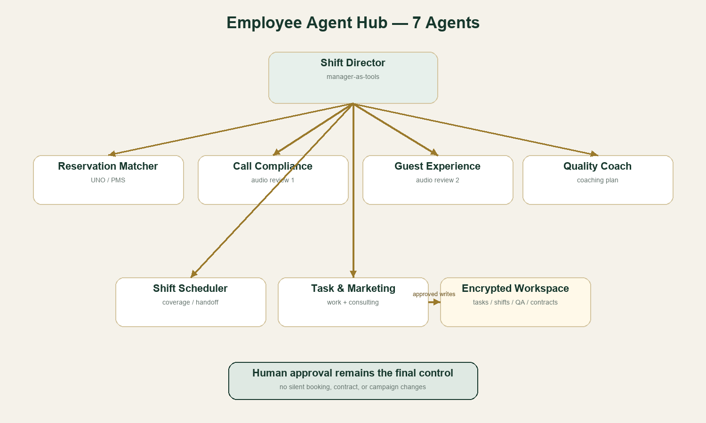
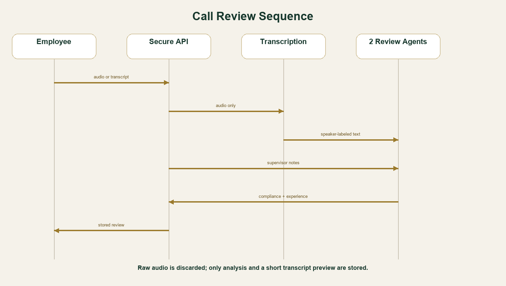

# مركز الموظفين والوكلاء

المركز متاح على المسار `/assistant` بعد تسجيل الدخول، ويجمع العمل التشغيلي في واجهة واحدة بدل تداول عدة ملفات Excel.

## الوكلاء السبعة

1. وكيل مطابقة الحجوزات: يبحث في لقطة UNO المحلية باستخدام رقم UNO/PMS دقيق، سبعة أرقام على الأقل من الهاتف، أو الاسم الكامل مع التاريخ.
2. مستمع الإجراءات: يراجع التحقق والدقة والخصوصية والوعود والتوثيق والتصعيد.
3. مستمع تجربة الضيف: يراجع الترحيب والإنصات والتعاطف والوضوح والإغلاق.
4. مدرب الجودة: يحول المراجعات وملاحظات المشرف إلى خطة تدريب قابلة للقياس.
5. منسق الشفت: يرتب التغطية والاستراحات والتسليم ويكشف التداخل.
6. مدير لوحة العمل: ينظم المهام ويصمم خطط الاستشارات التسويقية وتسليماتها.
7. مدير الوردية الذكي: ينسق الوكلاء الستة كأدوات ويقدم موجزًا موحدًا.

## الصلاحيات والخصوصية

- يجب أن يكون المستخدم مسجلًا بحساب موظف أو مشرف.
- `viewer` للقراءة فقط؛ لا يشغّل الوكلاء ولا يغير السجلات ولا يرفع المكالمات.
- `editor` و`admin` و`superadmin` يشغّلون الوكلاء ويضيفون ويحدثون البيانات.
- `editor` يستطيع إنشاء ملاحظة جودة أو مراجعة مكالمة لنفسه فقط. مراجعة موظف آخر مقصورة على `admin` و`superadmin`.
- حذف المهام والشفتات والجودة ومراجعات المكالمات مقصور على `admin` و`superadmin`.
- مشاريع الاستشارات التسويقية خاصة بمن أنشأها، وتُعزل بمعرّف مستخدم ثابت لا باسم الحساب. لا تُرسل قائمة المشاريع الخاصة تلقائيًا إلى أي وكيل؛ زر إنشاء الخطة يرسل فقط الحقول الظاهرة للمشروع الذي اختاره صاحبه.
- المشرف والمدير يريان مراجعات المكالمات والجودة كاملة؛ المحرر يرى ما أنشأه لنفسه، إضافة إلى الملاحظات والمراجعات التي أنشأها المشرف عنه وربطها بهوية حسابه.
- الملاحظات والمراجعات التي ينشئها المشرف تحمل هوية الموظف محل التقييم؛ تظهر لذلك الموظف وتدخل في سياق مدرب الجودة بعد الحجب، ولا تختلط بموظف آخر عند طلب تدريب باسمه.
- لا يبدأ مشروع تسويقي بحالة «قيد التنفيذ» قبل اعتماد الاتفاق أو تفعيل العقد.
- الملف الصوتي يُرسل إلى OpenAI للتفريغ، لكنه لا يُخزن خامًا في مساحة التطبيق. لا يُحفظ اسم الملف الأصلي ولا مقتطف التفريغ.
- قبل التحليل والتخزين تُحجب حتميًا أنماط بطاقات الدفع والجوال والهوية وOTP والبريد والمفاتيح والأسرار، ثم تُحجب مخرجات الوكلاء مرة ثانية. يستخدم مسار الوكلاء الحجب الصارم لكل رقم شبيه بالهاتف.
- مطابقة الحجز تتم داخل الخادم. لا يُرسل اسم الضيف أو UNO/PMS أو آخر أرقام الهاتف إلى النموذج؛ تعود النتائج التعريفية مباشرة إلى جلسة الموظف المصرح بها وتظهر في بطاقة محلية منفصلة.
- تُحذف مراجعات المكالمات بعد اكتمال 90×24 ساعة، ويمكن للمدير حذفها قبل ذلك. تُفهرس المراجعات الحديثة حسب ساعة انتهاء الاحتفاظ وتعمل الصيانة كل ساعة بدفعات متزامنة قابلة للاستكمال؛ وتبقى معالجة توافقية مستقلة للسجلات القديمة.
- استجابات Agents SDK مضبوطة على `store: false` والتتبّع الحساس معطل.
- يجب أن يؤكد الرافع وجود موافقة أو أساس نظامي لتسجيل المكالمة وتحليلها وفق سياسة جهة العمل والأنظمة السارية.
- تحمل الجلسات معرّف مستخدم وإصدار مصادقة؛ حذف الحساب يبطل الجلسات القائمة. جلسة حساب الأدمن المدار من البيئة تحمل كذلك بصمة غير قابلة للعكس للسر والاسم الحاليين، وتُرفض فور تدوير السر أو الاسم أو إزالة السر. أول نشر لهذا التغيير يتطلب تسجيل الدخول من جديد.
- تحفظ الحسابات كسجلات منفصلة ومشفرة، ولكل إنشاء جيل مستقل. مؤشر الحساب الحديث له أولوية مطلقة على مؤشر الترحيل القديم، فلا تستطيع كتابة قديمة متأخرة إعادة حساب حُذف أو أُنشئ من جديد. أثناء الترحيل تتحول كلمة المرور القديمة فورًا إلى PBKDF2 ثم يُحذف السجل الجامع القديم. حسابات superadmin الموروثة بلا مصدر اعتماد صريح تعامل احترازيًا كحسابات بيئة ولا يسمح لها بمسار كلمة المرور المحلية.
- تغيير كلمة المرور الذاتي معطل في مخزن Blobs الحالي لأنه لا يقدم معاملة شرطية ذرّية لهذا التدفق. تدوير حساب الاسترداد يتم عبر `ADMIN_PASSWORD_HASH` المشتق بـPBKDF2 فقط؛ لا يدعم النظام كلمة مرور أدمن نصية في البيئة. يصبح التدوير نافذًا في التحقق التالي لكل جلسة، وقبل الإنتاج يجب اعتماد موفّر هوية مؤسسي بمعاملات وMFA/SSO لإدارة تدوير كلمات مرور الموظفين.

## تشغيل مركز الاتصال متعدد المشاريع

المسار `/admin/call-center` يفتح قسم التشغيل مباشرة للمشرف والمدير، كما يظهر القسم داخل `/assistant` للموظفين المصرح لهم. يضم:

- سجل مشاريع مشترك بحالات تصميم وتجربة وتشغيل وإيقاف، وأهداف زمن خدمة ونسبة إجابة وساعات عمل.
- خمسة ملفات أدوات جاهزة: شركات عامة، مطاعم وضيافة، تقنية، مصارف، وقطاعات حكومية.
- لكل أداة مستوى موافقة ظاهر: قراءة تلقائية، قرار موظف، اعتماد مشرف، أو تكامل لا تنفذه إلا أنظمة الشركة.
- يسند المشرف حسابات الموظفين إلى كل مشروع ويختار الأدوات المفعلة له. الموظف غير الإداري يرى المشاريع المسندة إليه فقط، وترتبط المهام والشفتات بمعرف المشروع.
- سياق المشروع لا يُرفق للوكيل تلقائيًا؛ يختار الموظف مشروعًا واحدًا من قائمة واضحة قبل التشغيل.
- قطاعات المصارف والحكومة تتطلب مصدرًا مؤسسيًا رسميًا وصلاحيات أقل حدًا، ولا تسمح المنصة للوكيل بتجاوز إجراءات التحقق أو تنفيذ حركة مالية.

## Avaya والتوقعات

- المزامنة الحالية تستقبل تقارير Avaya الثلاثة اليومية عبر HTTPS وتدمجها دون الاحتفاظ بالملفات الخام بعد المعالجة.
- زر فتح Avaya لا يظهر فعالًا إلا إذا كان المستخدم `admin` أو `superadmin`، وكان `AVAYA_AGENT_URL` رابط HTTPS ومضيفه موجودًا حرفيًا في `AVAYA_ALLOWED_HOSTS`، وكُشف عنوان الطلب ووجد ضمن `ADMIN_NETWORK_CIDRS`. يفتح الرابط في نافذة مستقلة ولا يُضمّن داخل إطار غير معتمد. مجرد وضع `observe` أو تسجيل الدخول لا يكفي لإظهار الرابط.
- تشغيل صوت وكيل Avaya عبر Safari أو متصفح الهاتف ليس وعدًا من النظام. يعتمد على منتج Avaya وإصداره وترخيصه وجدول التوافق؛ المسار الافتراضي الموصى به للصوت الويب هو Chrome أو Edge بعد اعتماد الشركة، أو تطبيق Avaya الأصلي للجوال.
- Ethernet توصية جودة، وليس شيئًا يستطيع الخادم إثباته. شرط الإدارة يُطبق تقنيًا من خلال عنوان خروج شبكة أو VPN مؤسسي معتمد.
- التوقع يقبل فقط التقارير التي تمثل يومًا واحدًا، ويحتاج سبعة أيام على الأقل. يستخدم آخر 28 يومًا ونمط يوم الأسبوع واتجاهًا محدودًا، ويعرض نطاق عدم يقين بدل رقم قطعي.
- يمكن للمدير تصفية التوقع حسب المشروع ثم Queue أو Skill عبر معرّفات Avaya صريحة محفوظة في المشروع. لا يُنسب أي تقرير إلى مشروع إلا إذا حمل نطاقًا موثوقًا من مسار تقارير Avaya ومطابقًا حرفيًا؛ التقارير الحالية المجمعة حسب الموظف تبقى ضمن «الإجمالي» وتعرض النطاقات الخاصة «لا توجد بيانات مطابقة» بدل التخمين من أسماء الموظفين. وإذا كان للمشروع أكثر من معرّف، يجب اختيار معرّف واحد لتجنب ازدواج العد.
- `المعروض = المجاب + الفائت`. الفائت مؤشر تقريبي للدروب وليس `Queue Abandonment` رسميًا؛ القياس الرسمي يحتاج Queue Metrics أو Analytics/ECHI/CMS حسب منتج Avaya.
- أسباب ارتفاع أو انخفاض الفائت تفسيرات آلية قابلة للمراجعة مبنية على ضغط المكالمات لكل ساعة، ساعات التغطية، DND، الرنين، وانقطاعات الجلسة. لا تُعرض كإثبات سببي أو تقييم عقابي.

## قيد الشبكة المؤسسية

الإعداد الافتراضي لا يفعّل القفل حتى توفر الشركة عناوين الخروج الصحيحة، تفاديًا لحبس الإدارة خارج النظام. متغيرات Netlify:

```env
ADMIN_NETWORK_MODE=observe
ADMIN_NETWORK_CIDRS=203.0.113.18,10.20.0.0/16
AVAYA_AGENT_URL=https://approved-avaya.example.com/agent
AVAYA_ALLOWED_HOSTS=approved-avaya.example.com
AVAYA_PRODUCT_LABEL=Avaya product and version approved by IT
```

ابدأ بـ`observe` للتحقق من عناوين المكتب والـVPN، ثم غيّره إلى `enforce`. عند `enforce` يفشل دخول `admin` و`superadmin` خارج القائمة، وتُرفض جلساتهما على كل نقاط الخادم. حسابا `editor` و`viewer` لا يدخلان ضمن هذا القيد ما لم تعتمد الشركة سياسة أوسع.

## الاستضافة والنسخ الاحتياطي

- التطبيق والوظائف يعملان على Netlify عبر HTTPS، والشفرة محفوظة في GitHub.
- مساحة الموظفين محفوظة في Netlify Blobs مع غلاف AES-256-GCM بمفتاح `DATA_ENCRYPTION_KEY`.
- تنشئ وظيفة مجدولة نسخة مشفرة يومية وتحتفظ بها 30 يومًا. الاستعادة مقتصرة على `superadmin` وتعيد السجلات المفقودة فقط ولا تستبدل سجلًا موجودًا.
- يستطيع `superadmin` من صفحة تشغيل مركز الاتصال إنشاء لقطة فورية، عرض آخر اللقطات، واستعادة المفقود بعد تأكيد صريح.
- التسجيلات الصوتية لا تُخزن، ومراجعات المكالمات مستبعدة من النسخ الاحتياطية حتى لا تمتد مدة احتفاظها؛ وظيفة مستقلة كل ساعة تحذف الساعات المنتهية بعد 90 يومًا وتستكمل الدفعات المتبقية في التشغيل التالي.
- النسخة الحالية داخل مزود واحد تحمي من الحذف العرضي، لكنها ليست ضمانًا ضد انقطاع المزود أو فقدان المنطقة. تطبيق قاعدة 3 2 1 يحتاج نسخة ثانية مشفرة لدى مزود مستقل بعد اعتماد الشركة وسياسة معالجة البيانات.

## الإعداد

محليًا، ضع القيم في `.env.local` دون إضافتها إلى Git:

```env
OPENAI_API_KEY=...
DATA_ENCRYPTION_KEY=...
OPENAI_MODEL=gpt-5.6-sol
OPENAI_TRANSCRIBE_MODEL=gpt-4o-transcribe-diarize
ADMIN_USERNAME=...
ADMIN_PASSWORD_HASH=pbkdf2_sha256$...
ADMIN_NETWORK_MODE=off
ADMIN_NETWORK_CIDRS=...
AVAYA_AGENT_URL=...
AVAYA_ALLOWED_HOSTS=...
```

في Netlify أضف القيم نفسها إلى متغيرات بيئة الموقع. يمكن بدل المفتاح البيئي استخدام إعداد OpenAI المشفر الموجود في لوحة الإدارة. `DATA_ENCRYPTION_KEY` مطلوب لتشفير مساحة الموظفين على مستوى التطبيق.

## نقاط النهاية

- `GET/POST/PATCH/DELETE /api/employee/workspace`
- `POST /api/employee/agents`
- `POST /api/employee/call-review`
- `GET /api/call-center/operations`
- `GET/POST /api/employee/backups` للمشرف الأعلى فقط

كل نقاط النهاية تتحقق من جلسة الخادم. طلبات التغيير تقبل المصدر نفسه فقط، ولها حدود حجم ومعدل منفصلة.

التعليمات التشغيلية الأصلية للوكلاء موجودة في [`netlify/functions/_shared/employeeAgentRegistry.ts`](../netlify/functions/_shared/employeeAgentRegistry.ts) حتى يبقى لها مصدر حقيقة واحد.

## حدود النسخة الحالية

- رفع الصوت محدود بـ4 MB بسبب حدود طبقة الاستضافة، رغم أن واجهة التفريغ نفسها تدعم ملفات أكبر. الملفات الطويلة يجب ضغطها أو تقسيمها.
- حجب الأنماط يقلل التسرب العرضي، لكنه ليس بديلًا عن سياسة DLP مؤسسية أو مراجعة قانونية واعتماد إعدادات الاحتفاظ لدى مزود الذكاء الاصطناعي.
- الوكلاء لا ينفذون تغييرًا صامتًا في حجز أو عقد أو جدول. يستطيع الموظف اعتماد النتيجة صراحةً كمهمة، أو نقل اقتراح منسق الشفت إلى مسودة شفت يراجع أوقاتها قبل الحفظ، أو حفظ خطة مدير العمل داخل ملف الاستشارة.
- تكاملات CRM والتذاكر والمصارف والجهات الحكومية المعروضة في ملفات الأدوات هي عقود تشغيل وحدود صلاحية؛ لا تصبح اتصالات حقيقية قبل توفير API رسمي واعتماد أمني لكل مشروع.
- قفل الشبكة لا يستطيع اكتشاف نوع الكيبل؛ يعتمد على عنوان الخروج أو VPN، لذلك يجب إدارة القائمة لدى تقنية المعلومات ومراجعتها دوريًا.
- إدارة الحسابات المضمنة مناسبة للمعاينة والتشغيل المقيد، وليست بديلًا عن مخزن هوية transactional. لا يعتمد النظام إنتاجيًا قبل ربط SSO/MFA أو هوية مؤسسية معتمدة واختبار استرداد الحساب.
- إنشاء عقد قانوني، الفوترة، التحصيل، نشر الحملات أو إرسال رسائل للعميل تحتاج تكاملات واعتمادات منفصلة قبل التفعيل.




